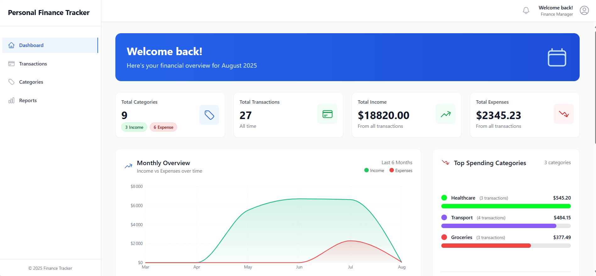
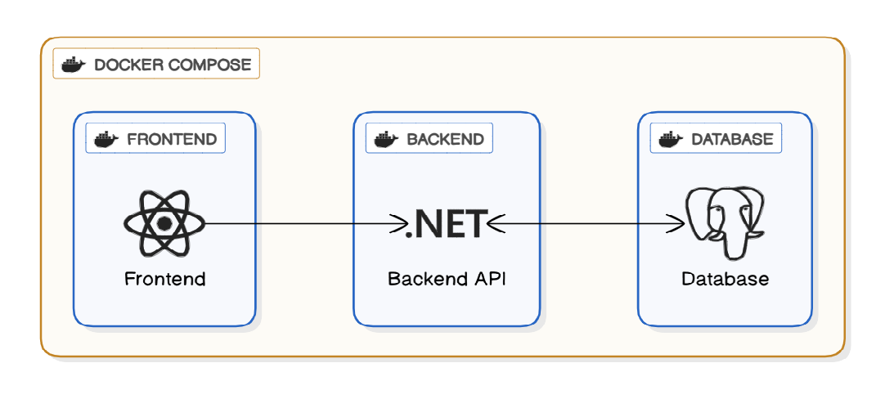
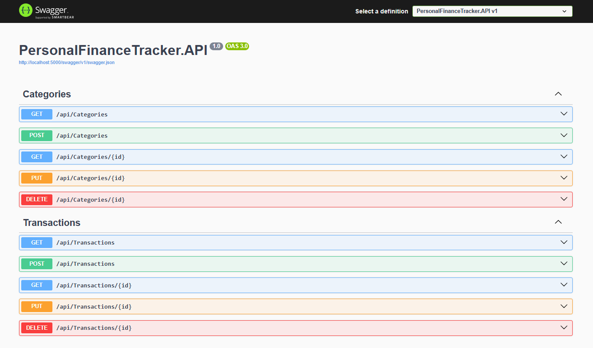
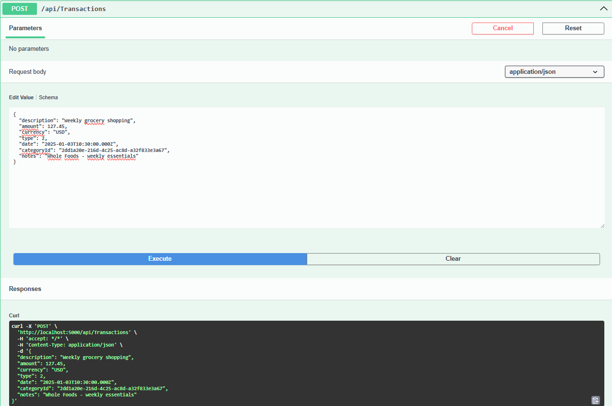
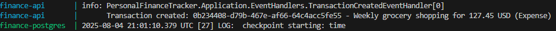

# Personal Finance Tracker

> A demonstration of Clean Architecture, CQRS, and Domain-Driven Design principles using .NET 9 and React.

A full-stack personal finance management application built with .NET 9, React, and PostgreSQL, demonstrating clean architecture principles, CQRS pattern, and domain-driven design.


## Architecture Overview



This application follows **Clean Architecture** principles with clear separation of concerns:

- **Domain Layer**: Core business logic, entities, value objects, and domain events
- **Application Layer**: Use cases, commands, queries, and application services
- **Infrastructure Layer**: Data persistence, external integrations, and infrastructure concerns
- **API Layer**: RESTful endpoints, controllers, and web configuration
- **Frontend**: React application with TypeScript and modern UI components

### Key Patterns Implemented

- **CQRS (Command Query Responsibility Segregation)** using MediatR
- **Domain Events** for decoupled business logic
- **Repository Pattern** for data access abstraction
- **Value Objects** for domain modeling
- **Domain-Driven Design** principles

## Technology Stack

### Backend

| Technology             | Description                               |
|------------------------|-------------------------------------------|
| **.NET 9**             | Latest framework version                  |
| **Entity Framework Core 9** | ORM with PostgreSQL provider          |
| **MediatR**            | CQRS and mediator pattern implementation  |
| **FluentValidation**   | Request validation                        |
| **PostgreSQL 15**      | Primary database                          |
| **Swagger/OpenAPI**    | API documentation                         |
| **Docker**             | Containerization                          |

### Frontend

| Technology          | Description                |
|---------------------|----------------------------|
| **React 19**        | UI library                 |
| **TypeScript**      | Type safety                |
| **Tailwind CSS**    | Utility-first styling      |
| **React Hook Form** | Form management            |
| **Zod**             | Schema validation          |
| **React Router**    | Client-side routing        |
| **Axios**           | HTTP client                |
| **Recharts**        | Data visualization         |


## Features

### Core Functionality
- **Category Management**: Create, update, delete income/expense categories
- **Transaction Management**: Full CRUD operations for financial transactions
- **Real-time Updates**: Instant UI updates across components
- **Data Validation**: Comprehensive client and server-side validation
- **Search & Filtering**: Advanced transaction filtering capabilities

### UI/UX Features
- **Responsive Design**: Mobile-first approach
- **Interactive Dashboard**: Charts and financial summaries
- **Modal Workflows**: Intuitive create/edit experiences
- **Loading States**: Professional loading indicators
- **Error Handling**: User-friendly error messages
- **Toast Notifications**: Real-time feedback

### Technical Features
- **Domain Events**: Automatic logging of business events
- **Database Migrations**: Automatic schema management
- **CORS Configuration**: Secure cross-origin requests
- **Health Checks**: Database connectivity monitoring
- **Docker Compose**: Complete containerized environment

## Quick Start

### Option 1: Docker Setup

#### Prerequisites
- Docker and Docker Compose
- Git

#### Running the Application

1. **Clone the repository**
   ```bash
   git clone https://github.com/hamzabourass/PersonalFinanceTracker.git
   cd PersonalFinanceTracker
   ```

2. **Start all services**
   ```bash
   docker-compose up --build
   ```

3. **Access the application**
   - Frontend: http://localhost:3000
   - API: http://localhost:5000
   - Swagger UI: http://localhost:5000/swagger
   - Database: localhost:5433

The application will automatically:
- Apply database migrations
- Seed sample data
- Start all services

### Option 2: Local Development Setup

#### Prerequisites
- .NET 9 SDK
- Node.js 20+ and npm
- PostgreSQL 15+
- Git

#### Database Setup

1. **Install PostgreSQL** and create a database:
   ```sql
   CREATE DATABASE PersonalFinanceDb;
   ```

2. **Update connection string** in `src/PersonalFinanceTracker.API/appsettings.json`:
   ```json
   {
     "ConnectionStrings": {
       "DefaultConnection": "Host=localhost;Port=5432;Database=PersonalFinanceDb;Username=your_username;Password=your_password"
     }
   }
   ```

#### Backend Setup

1. **Navigate to the API project**
   ```bash
   cd src/PersonalFinanceTracker.API
   ```

2. **Restore packages and run migrations**
   ```bash
   dotnet restore
   dotnet ef database update
   ```

3. **Run the API**
   ```bash
   dotnet run
   ```

The API will be available at:
- HTTP: http://localhost:5133
- Swagger UI: http://localhost:5133/swagger

#### Frontend Setup

1. **Open a new terminal and navigate to frontend**
   ```bash
   cd frontend
   ```

2. **Install dependencies**
   ```bash
   npm install
   ```

3. **Update API URL** in `frontend/src/services/api.ts`:
   ```typescript
   const api = axios.create({
     baseURL: 'http://localhost:5133/api', // Update port if different
   });
   ```

4. **Start the development server**
   ```bash
   npm run dev
   ```

The frontend will be available at: http://localhost:5173

#### Running Tests

**Backend Tests:**
```bash
# From the root directory
dotnet test

# Run specific test project
dotnet test tests/PersonalFinanceTracker.Domain.Tests/
dotnet test tests/PersonalFinanceTracker.Application.Tests/
```
## Project Structure

```
PersonalFinanceTracker/
├── src/
│   ├── PersonalFinanceTracker.Domain/
│   │   ├── Entities/              # Domain entities
│   │   ├── ValueObjects/          # Value objects (Money)
│   │   ├── Events/                # Domain events
│   │   └── Enums/                 # Domain enumerations
│   ├── PersonalFinanceTracker.Application/
│   │   ├── Commands/              # CQRS commands
│   │   ├── Queries/               # CQRS queries
│   │   ├── Handlers/              # Command/query handlers
│   │   ├── EventHandlers/         # Domain event handlers
│   │   ├── Validators/            # Request validators
│   │   └── DTOs/                  # Data transfer objects
│   ├── PersonalFinanceTracker.Infrastructure/
│   │   ├── Data/                  # Entity Framework configuration
│   │   └── Repositories/          # Repository implementations
│   └── PersonalFinanceTracker.API/
│       ├── Controllers/           # REST API controllers
│       ├── Migrations/            # Database migrations
|       └── Middleware/            # Middleware components (e.g., global exception handling)
├── frontend/
│   ├── src/
│   │   ├── components/            # React components
│   │   ├── pages/                 # Page components
│   │   ├── services/              # API services
│   │   ├── store/                 # State management
│   │   └── types/                 # TypeScript definitions
│   └── public/                    # Static assets
├── tests/                         # Unit tests
├── docker-compose.yml             # Container orchestration
├── Dockerfile                     # API container configuration
└── README.md                      # This file
```

## API Endpoints

### Categories
- `GET /api/categories` - List all categories
- `GET /api/categories/{id}` - Get category by ID
- `POST /api/categories` - Create new category
- `PUT /api/categories/{id}` - Update category
- `DELETE /api/categories/{id}` - Delete category

### Transactions
- `GET /api/transactions` - List transactions (with optional filtering)
- `GET /api/transactions/{id}` - Get transaction by ID
- `POST /api/transactions` - Create new transaction
- `PUT /api/transactions/{id}` - Update transaction
- `DELETE /api/transactions/{id}` - Delete transaction

## Database Schema

### Categories Table
- `Id` - Primary key (UUID)
- `Name` - Category name (required, unique)
- `Description` - Optional description
- `Type` - Income (1) or Expense (2)
- `Color` - Hex color code for UI
- `CreatedAt` - Timestamp
- `UpdatedAt` - Timestamp

### Transactions Table
- `Id` - Primary key (UUID)
- `Description` - Transaction description
- `Amount` - Decimal amount with currency
- `Currency` - Currency code (USD)
- `Type` - Income (1) or Expense (2)
- `Date` - Transaction date
- `CategoryId` - Foreign key to Categories
- `Notes` - Optional notes
- `CreatedAt` - Timestamp
- `UpdatedAt` - Timestamp

## Domain Events

The application implements domain events for business logic decoupling:

### Transaction Events
- `TransactionCreatedEvent` - Fired when a transaction is created
- `TransactionUpdatedEvent` - Fired when a transaction is updated
- `TransactionCategoryChangedEvent` - Fired when transaction category changes

### Event Handlers
- **TransactionCreatedEventHandler** - Logs transaction creation
- **TransactionUpdatedEventHandler** - Logs transaction updates
- **TransactionCategoryChangedEventHandler** - Logs category changes

### Domain Events in Action

#### Transaction Creation Flow

*API Request creates a new transaction*

  
*TransactionCreatedEvent automatically fired and logged*

Events are automatically dispatched after successful database saves and can be extended for notifications, analytics, or integration purposes.
